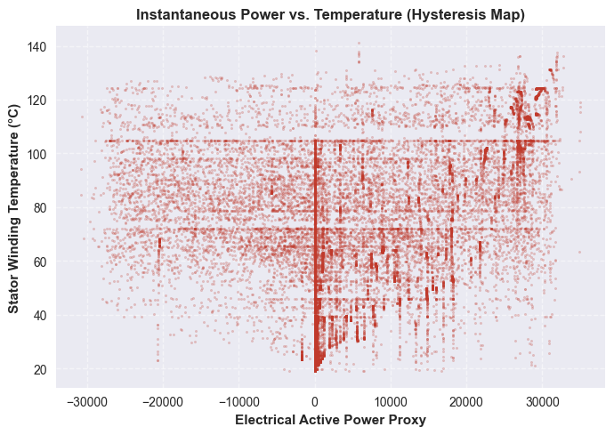
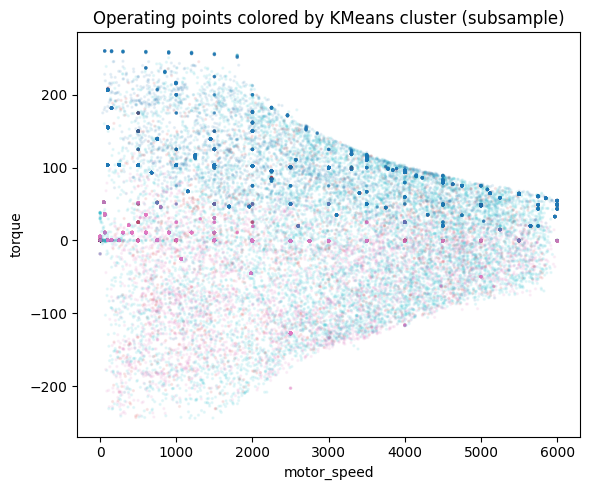
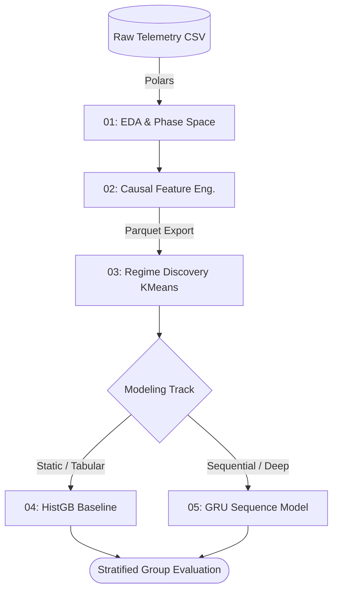
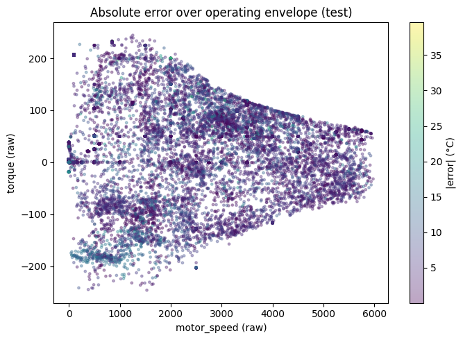

# PMSM Thermal Soft-Sensor: Learning Thermal Memory via Deep Sequence Models

**Physics-informed machine learning for stator temperature estimation in Permanent Magnet Synchronous Motors (PMSM) using Deep Sequential Learning (GRU) and rigorous group-aware validation.**


> **Note on Data Engineering:** Raw CSV files are strictly isolated for initial exploratory analysis. All downstream modeling, feature engineering, and sequence generation utilize columnar Parquet storage and Polars to maximize memory efficiency and computational performance.

---

## 1. Executive Summary & The Physical Bottleneck

In high-power-density electric drives, the **stator winding temperature (`stator_winding`)** acts as the primary operational constraint. It dictates insulation aging, influences the risk of permanent magnet demagnetization, and ultimately limits the motor's torque and current capabilities. 

Because physical thermocouples embedded within the stator are costly, prone to mechanical failure, and often unfeasible in mass-production environments, this project develops a **software-based temperature sensor (Soft-Sensor)**. 

<p align="center">
  
  <br>
  <em>Figure 1: Thermal Hysteresis demonstrating the massive dispersion between instantaneous power and temperature, highlighting the fundamental need for sequence memory.</em>
</p>

The core architectural hypothesis of this repository is physically rooted: 
*Instead of relying on static tabular features and manually engineered rolling windows, a Deep Sequence Model (GRU) can natively learn a latent "thermal memory" that accurately reflects heat accumulation and dissipation dynamics.*

## 2. Industrial Constraints & Dataset Architecture

We operate under strict industrial realism. The model must predict internal temperatures using only standard telemetry available on a production Electronic Control Unit (ECU).

* **Available Telemetry (Inputs):** Voltages (`u_d`, `u_q`), Currents (`i_d`, `i_q`), `motor_speed`, `torque`, and boundary temperatures (`coolant`, `ambient`).
* **Unobservable States (Strictly Excluded):** Internal mass temperatures (`pm`, `stator_tooth`, `stator_yoke`) are assumed unavailable in production to prevent target leakage.
* **Dataset Scope:** 2 Hz sampling rate, 69 distinct driving profiles (`profile_id`), encompassing ~1.3 million observations.

## 3. Methodological Rigor: The MLOps Validation Protocol

The most critical point of failure in time-series machine learning is temporal autocorrelation (data leakage). Because each driving profile represents a unique, causally independent trajectory with varying initial thermal states, standard randomized cross-validation is mathematically invalid.

<p align="center">
  
  <br>
  <em>Figure 2: Electromechanical phase space (Speed vs. Torque) segmented via Unsupervised Learning (K-Means). Identifying these foundational thermodynamic regimes dictates our stratified validation strategy, ensuring the Soft-Sensor performs reliably across traction, braking, and coasting states.</em>
</p>

To guarantee industrial-grade reliability, this pipeline enforces **Strict Group-Aware Validation**:
* **GroupShuffleSplit & GroupKFold:** All splits are executed strictly by `profile_id`. A driving session is either entirely in the training set or entirely in the validation/test set.
* **Causal Windowing:** Sequence generation is strictly bounded within individual profiles. Temporal windows never cross session boundaries.



## 4. Architectural Evolution: Tabular vs. Sequential

### Phase 1: The Statistical Baseline (HistGB)
We first establish a robust non-linear baseline using **Histogram-based Gradient Boosting**. To capture thermal inertia, we engineer explicit temporal proxies (rolling means, standard deviations, and discrete gradients over 5s to 300s windows).
* *Result:* Achieves a strong Mean Absolute Error (MAE) of **5.91°C**, proving that temporal feature engineering can successfully linearize complex thermodynamic interactions.

### Phase 2: Deep Sequence Learning (GRU)
Thermodynamic systems are fundamentally history-dependent. We deploy a **Gated Recurrent Unit (GRU)** (2 layers, Window = 300 samples / 150s) trained *exclusively on raw instantaneous signals*.
* *Result:* The GRU acts as a numerical integrator, natively learning the motor's thermal time constants. This architecture reduces the MAE to **4.27°C** (a **~28% performance uplift** over the HistGB baseline), demonstrating superior capability in tracking highly dynamic transients.

## 5. Performance Audit & Interpretability (XAI)

All deep learning metrics are reported as the mean and standard deviation across **3 independent stochastic seeds** to ensure algorithmic stability.

| Architecture | Protocol | MAE (°C) | RMSE (°C) | R² |
| :--- | :--- | :--- | :--- | :--- |
| Persistence Baseline | Group Holdout | 12.45 | 18.20 | 0.000 |
| HistGB (Engineered Features) | GroupKFold | 5.91 | 8.10 | 0.921 |
| **GRU (Raw Sequences, W=300)** | **Multi-Seed Holdout** | **4.27 ± 0.15** | **6.27 ± 0.07** | **0.957** |

<p align="center">
  
  <br>
  <em>Figure 3: Absolute error distribution of the GRU Soft-Sensor projected onto the electromechanical phase space (Test Set). This topography demonstrates the model's high reliability across standard operating regimes, accurately localizing residual errors to extreme transient states.</em>
</p>

**Physical Interpretability (Permutation Importance):**
An audit of the GRU confirms its alignment with electromagnetic principles:
1. **`u_q` (Quadrature Voltage):** Emerges as the dominant feature, acting as the primary proxy for active power injection and Joule heating.
2. **`motor_speed`:** Critical for estimating frequency-dependent iron losses and the efficiency of convective cooling.
3. **`coolant`:** Accurately identified as the fundamental boundary condition governing heat extraction.

## 6. Repository Architecture

```text
.
├── data/
│   ├── parquet/                     
│   ├── processed/                  
│   ├── raw/                     
│   └── README.md                  	 # Efficient columnar storage (ignored in git)
├── notebooks/
│   ├── 01_eda.ipynb                 # Phase space analysis and thermal inertia estimation
│   ├── 02_feature_engineering.ipynb # Causal rolling statistics and power proxy generation
│   ├── 03_unsupervised_regime.ipynb # PCA/KMeans isolation of thermodynamic states
│   ├── 04_supervised_ml.ipynb       # HistGB baseline and GroupKFold strict validation
│   └── 05_pytorch_sequence.ipynb    # GRU architecture, multi-seed training, and XAI
│ 
├── requirements.txt                 
└── README.md
